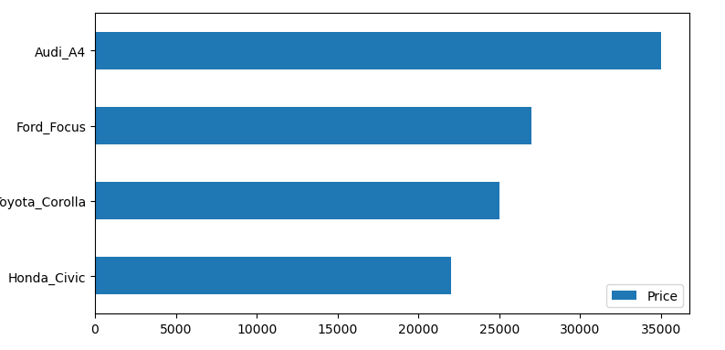
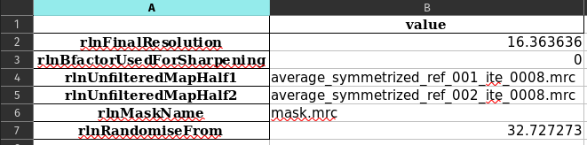
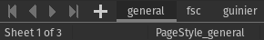

# starfile
[](https://travis-ci.com/alisterburt/starfile)
[](https://pypi.python.org/pypi/starfile/)
[](https://pypi.python.org/pypi/starfile/)
[](https://zenodo.org/badge/latestdoi/273026988)


`starfile` is a Python implementation of the [STAR](https://en.wikipedia.org/wiki/Self-defining_Text_Archive_and_Retrieval) file format.

It allows STAR files to be created and opened easily using a very simple API, exposing data blocks as [pandas](https://pandas.pydata.org/pandas-docs/stable/getting_started/overview.html) DataFrames.

This library aims to allow users and developers to read and write STAR files in Python as easily as possible, and with pandas as the only dependency. You can use it interactively to inspect files, to plot data or in scripts and larger software packages to provide basic STAR file I/O functions.

```
The STAR file: a new format for electronic data transfer and archiving
J. Chem. Inf. Comput. Sci. 1991, 31, 2, 326–333
Publication Date: May 1, 1991
https://doi.org/10.1021/ci00002a020
```
## Features
- Clean, simple API for reading and writing of STAR files
- Easy to install and use
- Conversion to Excel speadsheet (.xlsx)


## Installation
Installation is available directly from the [Python package index](https://pypi.org/project/starfile/)
```bash
pip install starfile
```


## Usage

### Reading STAR files
To open a STAR file
```python
>>> import starfile
>>> df = starfile.open('test/data/one_loop.star')
>>> df
      rlnCoordinateX  rlnCoordinateY  ...  rlnAngleTilt rlnAnglePsi
0           1572.444        1084.500  ...             0           0
1           1507.500        1104.357  ...             0           0
2           1512.432         973.500  ...             0           0
3           1560.385        1063.500  ...             0           0
4           1537.500        1060.500  ...             0           0
              ...             ...  ...           ...         ...
1360        1078.500         796.500  ...             0           0
1361        1075.500         784.500  ...             0           0
1362        1080.531         796.500  ...             0           0
1363        1045.992         737.411  ...             0           0
1364        1053.530         745.500  ...             0           0

[1365 rows x 12 columns]
```

Opening STAR files containing multiple data blocks will return a list of DataFrame objects.
```python
df = starfile.open('test/data/postprocess.star')
>>> len(df)
3
>>> df[0]
       rlnFinalResolution  ...  rlnRandomiseFrom
value           16.363636  ...         32.727273

[1 rows x 6 columns]
>>> df[1].head()
   rlnSpectralIndex  ...  rlnCorrectedFourierShellCorrelationPhaseRandomizedMaskedMaps
0                 0  ...                                           1.000000           
1                 1  ...                                           0.999964           
2                 2  ...                                           0.999856           
3                 3  ...                                           0.999421           
4                 4  ...                                           0.998708           

[5 rows x 7 columns]

>>> df[2].columns
Index(['rlnResolutionSquared', 'rlnLogAmplitudesOriginal',
'rlnLogAmplitudesWeighted'],
      dtype='object')
>>> df[2].name
'guinier'
```

This functionality is also exposed by `starfile.read` for convenience.

### Writing STAR files
DataFrame objects (or lists of dataframes) can be written to STAR files using `starfile.write`

```python
>>> cars = {'Brand': ['Honda_Civic', 'Toyota_Corolla', 'Ford_Focus', 'Audi_A4'],
                'Price': [22000, 25000, 27000, 35000]
                }

>>> df = pd.DataFrame(cars, columns=['Brand', 'Price'])
>>> df.name = 'cars'
>>> starfile.new(df, 'test/data/cars.star')
```

Produces a STAR file which looks like
```bash
# Created by the starfile python package (version 0.1) on 18/06/2020 13:26:32

data_cars

loop_
_Brand #1
_Price #2
Honda_Civic	22000
Toyota_Corolla	25000
Ford_Focus	27000
Audi_A4	        35000
```

This functionality is also exposed by `starfile.write` for convenience.

Floating point numbers will be written with 5 digits after the decimal separator (%.5f) by default. 
If you need to modify this behaviour, you can pass the keyword argument `float_format` to the function call.

For example

```python
starfile.new(df, 'test.star', float_format='%.12f')
```

Any keyword arguments to `starfile.new()` are passed through to pandas [DataFrame.to_csv()](https://pandas.pydata.org/pandas-docs/stable/reference/api/pandas.DataFrame.to_csv.html)

### Plotting
One of the reasons for using DataFrame objects is that they provide some convenient data plotting tools
```
>>> bars = df.plot.barh(x='Brand', y='Price')
```



This functionality depends on the `matplotlib` package, providing endless opportunity for customisation.

```python
>>> bars
<matplotlib.axes._subplots.AxesSubplot object at 0x7f3ed8f35640>
```

### Converting STAR files to an Excel Spreadsheet
Perhaps you aren't comfortable plotting in Python, or maybe a journal requires submission of raw data for presented 
figures as an excel spreadsheet. This is supported with the `star2excel` function.

```python
>>> starfile.star2excel('test/data/postprocess.star', 'test/data/postprocess.xlsx')
```

produces an Excel spreadsheet including column and row names from the DataFrame.



Multi-block STAR files are written as multi-sheet Excel spreadsheets



This functionality depends upon the `openpyxml` package


## License
The project is released under the BSD 3-Clause License

## Known Issues
- Cannot handle more than one loop in a data block as found in mmCIF files